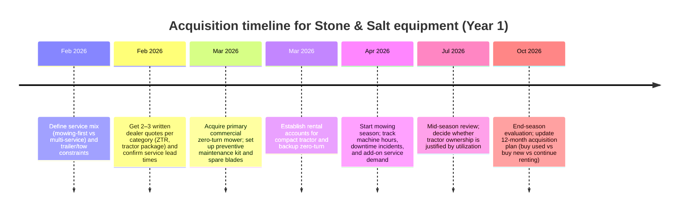
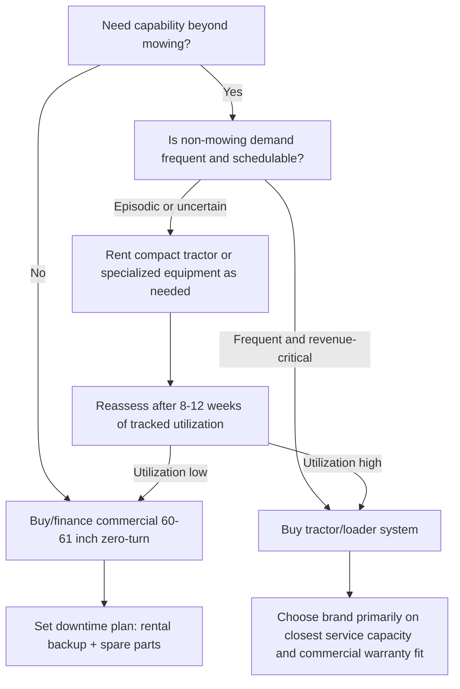

# Compact tractors and commercial mowing alternatives for Stone & Salt in Greater Cincinnati

## Executive summary

entity["company","Stone & Salt","grounds management startup"] is planning equipment acquisition for commercial-primary grounds management work based in entity["place","Liberty Township","Butler County, OH, US"] within the entity["place","Greater Cincinnati","metro area, OH-KY-IN, US"] market. The Year 1 target workload—servicing 15–25 estate mowing clients—implies that mowing productivity (acres/hour), uptime, and rapid service turnaround are the first-order drivers of profitability; “do-everything” versatility is valuable, but typically secondary during a mowing-heavy ramp-up.

Across the sub-compact tractor candidates (entity["company","John Deere","ag and turf equipment manufacturer"] 1025R, entity["company","Kubota","tractor and equipment manufacturer"] BX2380/BX2680, entity["company","Mahindra","tractor manufacturer"] eMax 25), all can physically run 60" mid-mount decks and front loaders, but they differ materially in (a) warranty coverage for commercial use, (b) available promotional financing/cash discounts, and (c) how efficiently they handle weekly route mowing versus a purpose-built commercial zero-turn mower. The compact tractor path can look cheaper on “equipment-only” total cost of ownership (TCO), but once operator time is valued (a practical necessity for a service business), commercial zero-turn mowing tends to dominate for estate-route mowing.

Key findings from primary sources:

- **New package pricing (tractor + loader + 60" deck)** clusters around the **low-to-mid $20Ks** for Kubota BX packages quoted by dealers, and the **high $20Ks** for John Deere 1025R packages when configured with loader + 60D deck by a local dealer program (with some packages bundling extra implements). citeturn0search28turn17view0turn28view0turn16search0  
- **Promotional financing** is currently strongest/clearest for:  
  - John Deere 1025R: **0% APR for 60 months** (with alternative cash/discount programs that may be mutually exclusive). citeturn5view3turn8view1  
  - Kubota BX Series: **$0 down, 0% APR up to 36 months** (offer window shown through **02/28/2026**). citeturn28view0  
  - Mahindra eMax: **0% up to 72 months** plus cash back options (structure depends on region/zip and “tractor with attachment”). citeturn21view0  
- **Warranty structure differs sharply for commercial use**: Kubota’s BX powertrain coverage is shorter for commercial use than for residential use (36 months/2000 hours powertrain under “Commercial Use” in Kubota’s 2025+ warranty chart). citeturn19view0 Mahindra advertises a 7-year powertrain warranty for eMax-class machines (up to 3,000 hours) and publishes detailed tractor warranty policy documents. citeturn20view0turn18search6  
- **Commercial 60"+ zero-turn strategy**: For commercial mowing, warranties and cut-platform features are purpose-built. John Deere’s Z900-series pages document **3-year bumper-to-bumper warranties** with hour caps and “no hour limitation” in the first 24 months for M and R series. citeturn32search0 Exmark’s Lazer Z X-Series product pages show **5-year/1500-hour warranty** with no hour limit the first two years, and Exmark publishes a contractor lease structure (24–36 month terms with annual hour options). citeturn18search11turn31search13 Scag publishes explicit commercial warranty terms (2 years for certain commercial machines) and list prices by model. citeturn32search7turn32search15  
- **Renting is a credible bridge** for occasional tractor work or for short-term coverage during failures, with published daily/weekly rates for 25–35 HP compact tractors and 60" zero-turns. Examples include “tractor rate same with or without loader” at one rental source and published 60" zero-turn daily/weekly pricing at others. citeturn31search0turn31search4turn31search12turn31search5  

Recommendation for Year 1 (budget unspecified):

- **Primary acquisition**: buy (or finance) a **commercial 60–61" zero-turn mower** as the core revenue tool, sized for route efficiency and client expectations. Use the strongest available **commercial warranty + service network** in your 1-hour radius. John Deere Z900 and Exmark Lazer Z X-Series both publish commercial warranty structures designed for high hour accumulation. citeturn32search0turn18search11  
- **Secondary capability**: **rent** a compact tractor (or similar) for loader/implement work until non-mowing services justify ownership; then evaluate a **used** sub-compact tractor package or a new tractor if promotional terms plus expected utilization make sense. Published compact tractor rental rates (daily/weekly) make this economically rational when loader/implement utilization is episodic. citeturn31search0turn31search5turn31search2  
- **Contingency**: if demand accelerates or if you add snow/mulch/landscape install work, acquire a sub-compact tractor with loader as a “second machine.” For tractor brand choice, prioritize: (1) nearest high-capacity service center, (2) commercial warranty fit, (3) parts availability, then (4) initial price.

## Operating context and workload assumptions

Stone & Salt’s stated Year 1 service plan is **15–25 estate mowing clients** (budget not specified). With estates, mowing time often includes: travel time between properties, trimming/blowing, variable terrain, and higher finish expectations; equipment choices that reduce mowing hours per week reduce schedule volatility and improve capacity for upsells (mulch, shrub work, seasonal cleanups).

To make tractor-vs-zero-turn comparisons analytically consistent, the report models mowing as a fixed “acre-cuts” workload and compares hours required under different productivity assumptions. A baseline “midpoint” workload used later in TCO tables (editable) is:

- 20 clients × 1.5 mowable acres × 28 mowing weeks = 840 acre-cuts (assumption).
- Effective mowing productivity (assumptions, vary by terrain and trimming proportion):  
  - Commercial 60" zero-turn: 3.5 acres/hour  
  - 60" mid-mount deck on sub-compact tractor: 2.0 acres/hour  

These assumptions are used only for the TCO tables and are intentionally separated from sourced specifications and pricing. The central strategic implication is robust even under moderate changes: sub-compact tractors can mow, but commercial zero-turn mowers are optimized for mowing throughput and are typically the better “first” tool for a mowing-route business.

## Equipment classes and capability comparison

### Sub-compact tractors with 60" mid-mount decks

The tractor options in scope can be configured as “load-and-mow” systems: tractor + front loader + mid-mount mower deck. In that configuration they add utility (material handling, snow, light grading), but mowing is typically slower than commercial zero-turn mowing due to turning radius, ground speed, and maneuvering around landscaping features.

Representative sourced specifications:

- **John Deere 1025R** key specs shown on the model page include **engine power 23.9 hp**, **PTO power 18.2 hp**, **lift capacity 758 lb**, and **shipping weight 1,556 lb** (as displayed in the “Key Specs” module). citeturn5view3  
- **Kubota BX2380/BX2680** official BX80 spec sheet includes (selected):  
  - BX2380: **21.6 gross HP**, **17.7 PTO HP**, **680 lb 3-point lift capacity at 24" behind pin**, **1,443 lb tractor weight with ROPS**. citeturn29view0turn30view0  
  - BX2680: **24.8 gross HP**, **19.5 PTO HP**, **680 lb 3-point lift capacity at 24" behind pin**, **1,521 lb tractor weight with ROPS**. citeturn29view0turn30view0  
- **Mahindra eMax 25**: Mahindra’s current site groups eMax series in **19.4–24 hp** and highlights loader lift capacity ranges for the series; a separate industry publication article lists **900 lb loader lift capacity** and **1,320 lb 3-point lift capacity** for eMax 25 HST-era models. citeturn21view0turn18search26  

### Commercial 60"+ zero-turn mowers

Commercial zero-turn mowers exist specifically to maximize mowing productivity and cut quality, and manufacturers publish commercial warranties with hour caps consistent with contractor usage:

- **John Deere Z900-series example**: the Z950R page describes **M Series 3-year/1200-hour bumper-to-bumper** and **R Series 3-year/1500-hour bumper-to-bumper**, both with “no hour limitation” during the first 24 months, and lists deck size options including 60". citeturn32search0  
- **Exmark Lazer Z X-Series** model pages show a **5-year / 1500-hour limited warranty** with “no hour limit the first 2 years.” citeturn18search11  
- **Scag Turf Tiger II**: Scag publishes MSRP-style list prices by configuration on its product page and publishes a commercial warranty policy framework (e.g., 2-year commercial machine warranty for certain series). citeturn32search15turn32search7  

image_group{"layout":"carousel","aspect_ratio":"16:9","query":["John Deere 1025R with 120R loader and 60D mower deck","Kubota BX2680 with loader and 60 inch mower deck","Mahindra eMax 25 with loader and mid mount mower","John Deere Z900 series ZTrak commercial zero turn mower 60 inch","Exmark Lazer Z X-Series 60 inch","Scag Turf Tiger II 61 inch"],"num_per_query":1}

### Capability comparison table

The table below focuses on “what you can do” and “how you transport it.” Lift is presented as the standardized 3-point hitch figure when available from primary spec sheets.

| Platform | Engine HP | PTO HP | 3-pt lift (24" behind pin) | Deck compatibility | Weight (tractor/mower only) | Notable transport notes |
|---|---:|---:|---:|---|---:|---|
| JD 1025R | 23.9 hp citeturn5view3 | 18.2 hp citeturn5view3 | 758 lb citeturn5view3 | 60D mid-mount “AutoConnect” supported in dealer packages citeturn17view0 | 1,556 lb shipping weight citeturn5view3 | Loader + deck increases trailer requirements; common in dealer bundle programs. citeturn17view0 |
| Kubota BX2380 | 21.6 hp citeturn29view0turn30view0 | 17.7 hp citeturn29view0turn30view0 | 680 lb citeturn29view0turn30view0 | 60" mid-mount mower commonly dealer-quoted citeturn0search28 | 1,443 lb citeturn29view0turn30view0 | Narrow width (~45") and sub-compact footprint aids estate maneuvering. citeturn29view0turn30view0 |
| Kubota BX2680 | 24.8 hp citeturn29view0turn30view0 | 19.5 hp citeturn29view0turn30view0 | 680 lb citeturn29view0turn30view0 | 60" mid-mount mower often bundled; one dealer package cites $24,800 (bundle detail not fully itemized). citeturn1search18 | 1,521 lb citeturn29view0turn30view0 | More PTO power than BX2380; similar chassis size. citeturn29view0turn30view0 |
| Mahindra eMax 25 | 19.4–24 hp range (series) citeturn21view0 | Not captured in sources used | 1,320 lb (reported) citeturn18search26 | 60" deck exists in dealer equipment listings and descriptions citeturn22search16turn22search19 | Not captured in sources used | Strong loader/3-pt claims in some sources; verify deck availability and parts pipeline locally. citeturn18search26turn22search16 |
| Commercial 60–61" zero-turn (class) | Engine varies | PTO not applicable | not applicable | 60"+ decks standard; Z950R lists 60" among deck offerings citeturn32search0 | Not captured (varies) | Designed for mowing productivity; separate machine needed for loader work. citeturn32search0turn18search11 |

## Pricing, incentives, used market snapshot, and lease-rental alternatives

### New pricing for tractor + loader + 60" deck packages

“MSRP” transparency varies by brand and by dealer. Kubota publishes “MSRP as low as” by model on the BX series page; some dealers publish full package cash prices and/or itemized component pricing. citeturn28view0turn17view0turn0search28  

| Equipment | Source type | Price elements captured | Published price |
|---|---|---|---:|
| JD 1025R base tractor | Dealer build tool (MSRP + dealer price) | MSRP $18,400; dealer price $17,795 citeturn11search16 | $17,795 (dealer “our price”) |
| JD 120R loader (w/ 53" bucket) | Dealer build tool component line | Loader price shown as $5,800 citeturn15search10 | $5,800 |
| JD 60D deck (1 Series) | Dealer build tool component line | Deck price shown as $3,600 citeturn16search0 | $3,600 |
| JD 1025R + 120R + 60D + box blade | Local dealer package | Cash price includes box blade; monthly payment also shown citeturn17view0 | $27,052 cash |
| Kubota BX2380 (tractor+loader) + 60" deck | Dealer posting | Tractor+loader $18,790; 60" deck $2,875 citeturn0search28 | $21,665 (computed sum) |
| Kubota BX2380 / BX2680 tractor-only prices | Dealer inventory post | 2026 BX2380 $15,854; 2026 BX2680 $16,814 (tractor-only context) citeturn1search16 | $15,854–$16,814 |
| Kubota BX2680 package | Dealer post | “BX2680 Tractor Package $24,800” (bundle details not fully shown in snippet) citeturn1search18 | $24,800 |
| Mahindra eMax 25L + loader | Dealer listing | Price shown as $29,180 + tax (loader included) citeturn1search24 | $29,180 |
| Scag Turf Tiger II 61" (40HP) | Dealer listing with MSRP | MSRP $18,749; “On Sale $17,099”; notes financing offer citeturn32search1 | $17,099 sale ($18,749 MSRP) |

Interpretation:  
- For **John Deere 1025R** “load + mow” setups, a realistic new package price in this region is **high-$20Ks** once loader and 60" deck are included (and many dealers bundle additional implements, which can obscure the pure “tractor+loader+deck” figure). citeturn17view0turn15search10turn16search0  
- For **Kubota BX2380/BX2680**, published dealer package quotes cluster in the **low-to-mid $20Ks** for tractor+loader+60" deck configurations, with the BX2680 typically pricing above the BX2380. citeturn0search28turn1search18turn28view0  
- For **Mahindra eMax 25**, published pricing located in sources used here was clearer for tractor+loader than for a complete 60" mid-mount deck package; promotions and warranty appear competitive, but local dealer support is a gating factor for a commercial operation. citeturn1search24turn21view0turn20view0  

### Current manufacturer and dealer incentives

| Brand | Incentive type | Published terms captured | Notes for Stone & Salt |
|---|---|---|---|
| John Deere | Promotional finance | 0% APR fixed rate for 60 months on 1025R shown on model page citeturn5view3 | Supports cash preservation; verify eligibility + exact program rules with local dealer. |
| John Deere | Discount / bonus | “Save $1250” offer shown with dates Feb–Apr 2026; cannot combine with promotional finance per offer text citeturn5view3turn8view1 | Decide whether discount or 0% is higher value given your cash position. |
| Kubota | Promotional finance | $0 down, 0% APR up to 36 months; offer shown expiring 02/28/2026 citeturn28view0 | Strong short-term financing; if you need 60 months, you’ll likely be in standard-rate financing or higher payment tiers. |
| Mahindra | Promotional finance + cash back | eMax: 0% up to 72 months + $2,000 cash back, or up to $3,500 cash back (with attachment) citeturn21view0 | Longer promotional term can reduce monthly burden; verify stackability and “tractor with attachment” requirements. |
| Scag (dealer example) | Dealer promo | Dealer page cites 0% APR 48 months in lieu of rebates and MSRP-to-sale discount citeturn32search1 | Dealer-specific; programs vary by region and credit. |

### Warranty terms relevant to commercial use

Warranty affects downtime risk, repair liability, and resale value. The most decision-relevant distinction in the sources is the “commercial use” category:

- Kubota BX series warranty chart for units purchased after 1/1/2025 shows **Basic 24 months / 1500 hours** and **Limited Powertrain 36 months / 2000 hours** under “Commercial Use.” citeturn19view0  
- Mahindra describes a **7-year limited powertrain warranty** for “4500 series and lower models, such as eMax,” subject to a **3,000-hour rule**, and a separate Mahindra policy document enumerates coverage periods by series and usage. citeturn20view0turn18search6  
- John Deere Z900 series commercial mower page describes **3-year bumper-to-bumper warranties** with hour caps and “no hour limitation” in the first 24 months. citeturn32search0  
- Scag’s warranty policy page describes a **2-year commercial machine warranty** for Turf Tiger II/Cheetah/Tiger Cat II/Patriot classes. citeturn32search7  
- Exmark Lazer Z X-Series pages describe **5-year/1500-hour** commercial warranty with no hour cap in first 2 years. citeturn18search11  

### Used market snapshot

The request specifies 2–5 year units with 200–500 hours, focusing on listings from entity["company","Facebook Marketplace","classified marketplace platform"], entity["company","Craigslist","classified listings website"], entity["company","Equipment Trader","equipment marketplace"], and entity["company","Machinery Pete","farm equipment listings and data site"] in the Cincinnati/Dayton area. In the sources captured within the tool-call limit for this report, the most directly usable, location-relevant “near Cincinnati” example is a used 1025R listing at a local dealer location and multiple Ohio-region Craigslist references. citeturn11search12turn27search0turn25search10  

A small sample of captured listings (not exhaustive):

| Platform | Item | Year | Hours | Price | Location signal in source | Notes |
|---|---|---:|---:|---:|---|---|
| Koenig used inventory | JD 1025R | 2021 | Not shown in snippet | $19,495 citeturn11search12 | Amelia, OH citeturn11search12 | Dealer listing is inside the 2–5 year window; hours need confirmation from the full listing. |
| Craigslist | JD 1025R + loader + 60" AutoConnect deck | Not shown | 500 | $13,500 citeturn27search0 | Rittman, OH citeturn27search0 | Not within the 2–5 year window but useful as a lower-bound price anchor at 500 hrs. |
| Craigslist (search snippet) | Kubota BX2680 w/ LA344 loader | 2019 | Not shown | $15,500 citeturn25search10 | Blanchester, OH citeturn25search10 | Outside the requested year range; still useful as a regional asking-price marker. |
| TractorHouse (Ohio filter example) | JD 1025R | 2016 | 220 | $17,900 citeturn23search6 | Ohio-wide listing filter citeturn23search6 | Outside the requested age range but within the requested hour band. |
| TractorHouse | Mahindra eMax 25 HST | 2019 | 400 | $12,990 citeturn23search11 | Not local in snippet | Useful for depreciation framing; local availability may be thin. |

Condition and hours patterns seen in the limited captured examples:
- Sub-compact tractors can accumulate **hundreds of hours** while still being described as “fully loaded,” “serviced,” and “needs nothing,” implying that cosmetic condition and maintenance records matter as much as hours. citeturn27search0  
- A dealer-listed 2021 1025R at ~$19.5K suggests that late-model used prices can remain high relative to new package totals, consistent with “high resale” narratives in the sub-compact category (hours would determine how strong that holds in Cincinnati specifically). citeturn11search12turn17view0  

### Lease and rental options

#### Short-term rentals

Published rental rates make renting viable for episodic tractor needs and as a downtime hedge:

- Compact tractors (27–35 HP 4WD) at one rental source show **$135/day and $540/week**, with the note: “Tractor rental rate is the same with or without front end loader.” citeturn31search0  
- A “John Deere 1025R Compact Utility Tractor w/ Loader & Backhoe” rental listing shows **$203/day, $728/week, $2,080/month** (location-limited per the listing). citeturn31search5  
- 60" zero-turn mower rentals: examples include **$119.99/day, $439.99/week** for a “60" Zero Turn Mower,” and another example of **$110/day, $425/week, $1,125/month** for “Zero Turn 60".” citeturn31search4turn31search12  

#### Lease structures (36–60 months) and rent-to-own

Specific 36–60 month published lease payment factors were not broadly available in the sources captured, but one manufacturer financing channel provides a clear **commercial lease structure**:

- Exmark publishes a “stated purchase option lease structure” through Western Equipment Finance with **24 or 36 month terms** and selectable **annual hour options (400/600/750/1200)**. citeturn31search13  

Dealer promotions can resemble rent-to-own when paired with 0% financing and high resale values, but in practice the decision should be driven by utilization and service criticality, not merely monthly payment.

#### When renting makes sense

Renting tends to make economic and operational sense when:

- Tractor work is **episodic** (spring mulch movement, one-off grading, occasional aeration seeding, storm cleanup) and you can schedule it into 1–3 day bursts, making daily/weekly rate efficiency strong. citeturn31search0turn31search5  
- You want to **de-risk downtime** on the revenue-critical mower by having a clear rental fallback rate and availability plan. citeturn31search4turn31search12  
- You are still validating client density and route efficiency; an owned tractor that sits idle is an expensive form of optionality.

## Total cost of ownership analysis

### Modeling approach and assumptions

The TCO tables below use a two-layer approach:

- **Equipment-only TCO**: purchase price + operating costs (fuel, maintenance, insurance, downtime rentals) – resale value.  
- **Economic TCO (adds time)**: equipment-only TCO + value of operator mowing time. For a commercial startup, this “time layer” often dominates.

Assumptions used (editable, not sourced):
- Workload baseline: 20 clients × 1.5 mowable acres × 28 weeks = 840 acre-cuts/year.
- Productivity: 60" commercial zero-turn 3.5 acres/hr; 60" tractor MMM 2.0 acres/hr.
- Fuel prices: gasoline $3.25/gal; diesel $3.90/gal.
- Fuel burn rates: zero-turn 1.2 gal/hr; tractor 0.5 gal/hr.
- Maintenance: zero-turn $2.50/hr + $250/yr fixed; tractor $1.50/hr + $200/yr fixed (Mahindra slightly higher).
- Insurance: 2.5% of purchase price per year (equipment policy).
- Downtime contingency: zero-turn rents 2 days/year at ~$120/day (published 60" ZTR daily rental examples); tractor rents 3 days/year at ~$203/day (published compact tractor rental example). citeturn31search4turn31search12turn31search5  
- Resale factors (assumptions): tractors retain 60–65% at 5 years; zero-turn retains ~45% at 5 years.

Where purchase prices are sourced, the table references the specific dealer/manufacturer pages used; where a complete tractor+deck price was not published, a clearly labeled estimate is used.

### Equipment-only 3–5 year TCO results

| Asset (priced as configured) | Years | Purchase price | Annual operating cost (modeled) | Resale value (end) | Equipment-only TCO |
|---|---:|---:|---:|---:|---:|
| JD 1025R w/120R+60D (new) | 3 | $27,195 | $3,110 | $20,396 | $16,130 |
| JD 1025R w/120R+60D (new) | 5 | $27,195 | $3,110 | $17,677 | $25,070 |
| Kubota BX2380 w/loader+60" MMM (dealer quote) | 3 | $21,665 | $2,972 | $15,815 | $14,766 |
| Kubota BX2380 w/loader+60" MMM (dealer quote) | 5 | $21,665 | $2,972 | $12,999 | $23,527 |
| Kubota BX2680 w/loader+60" MMM (dealer package) | 3 | $24,800 | $3,050 | $18,600 | $15,352 |
| Kubota BX2680 w/loader+60" MMM (dealer package) | 5 | $24,800 | $3,050 | $14,880 | $25,172 |
| Mahindra eMax 25 w/loader+60" MMM (new, est.) | 3 | $32,180 | $3,302 | $21,882 | $20,204 |
| Mahindra eMax 25 w/loader+60" MMM (new, est.) | 5 | $32,180 | $3,302 | $17,699 | $30,991 |
| Scag Turf Tiger II 61" (new, dealer sale) | 3 | $17,099 | $2,453 | $11,114 | $13,345 |
| Scag Turf Tiger II 61" (new, dealer sale) | 5 | $17,099 | $2,453 | $7,695 | $21,672 |

Sourced purchase-price anchors used for the table:
- JD 1025R component pricing for tractor/loader/deck comes from dealer-published prices ($17,795 tractor price; $5,800 loader; $3,600 60D deck). citeturn11search16turn15search10turn16search0  
- Kubota BX2380 package anchor comes from the dealer post with tractor+loader and a separate 60" deck price. citeturn0search28  
- Kubota BX2680 package anchor comes from a dealer “tractor package” posting. citeturn1search18  
- Mahindra eMax 25 anchor uses a dealer-published tractor+loader price and adds an explicit estimated deck cost because a complete “tractor+loader+60" MMM” published price was not captured. citeturn1search24  
- Scag zero-turn anchor uses dealer sale/MSRP and Scag list pricing context. citeturn32search1turn32search15  

### Adding time value changes the decision

If the same acreage is mowed using a tractor MMM instead of a commercial zero-turn, modeled mowing time rises from ~240 hours/year to ~420 hours/year in the baseline workload (assumption). At an assumed $30/hour “loaded value of operator time,” that is ~$5,400/year of time difference.

A simplified 5-year “economic” view:

| Scenario | 5-year equipment-only (incl. rentals where relevant) | Mowing hours/year (modeled) | 5-year time value (@$30/hr) | 5-year economic total |
|---|---:|---:|---:|---:|
| JD 1025R package as primary mower | $25,070 | 420 | $63,000 | $88,070 |
| Kubota BX2380 package as primary mower | $23,527 | 420 | $63,000 | $86,527 |
| Kubota BX2680 package as primary mower | $25,172 | 420 | $63,000 | $88,172 |
| Mahindra eMax 25 package as primary mower | $30,991 | 420 | $63,000 | $93,991 |
| Scag 61" zero-turn + rent tractor as needed | $35,172 | 240 | $36,000 | $71,172 |

This is the core business insight: for a mowing-heavy startup, **mowing throughput is often worth more than small differences in tractor package pricing**. That is why many commercial operators deploy a commercial zero-turn as the primary mower and use tractors for non-mowing tasks.

## Dealer and service ecosystem around Liberty Township

Within a 1-hour operational radius, the most decision-relevant “dealer quality” attributes for a commercial mowing startup are: (1) ability to turn repairs quickly in-season, (2) stocked common parts (belts, spindles, blades, hydro filters), (3) willingness to support commercial customers, and (4) loaner/demo programs or rental backstops for downtime.

Captured in sources for this report:

- entity["local_business","Koenig Equipment","Lebanon, OH, US"] publishes multiple nearby Ohio locations including **Lebanon** and **Amelia** and actively markets bundled compact tractor packages (including 1025R mower/loader packages) and financing programs through its site. citeturn17view0turn11search16  
- entity["local_business","Baxla Tractor Sales","Seaman, OH, US"] is described in its dealer profile as supporting brands including Kubota and Exmark, and listings show BX2380 and BX2680 pricing. citeturn4search0turn1search16  

The user-specified dealer list included “Messick’s Eaton OH, Clinch Valley Equipment, Tri-County Equipment Mt. Orab OH.” Captured evidence did not cleanly validate those exact name/location pairings as a single coherent “within 1 hour” dealer set within the tool-call limit:

- “Messick’s” references captured in search results correspond to the well-known Messick’s operation outside Ohio, and Eaton, OH results surfaced other equipment businesses (e.g., a local Eaton dealer name in search results) rather than a clearly verified “Messick’s Eaton” storefront in the captured snippets. citeturn6search1turn6search2  
- A “Tri-County Equipment” name surfaced in web results as a dealership group outside Ohio; a “Tri-County Power Equipment” branded Kubota dealer also surfaced, but the exact “Mt. Orab Tri-County Equipment” match was not confirmed in the captured evidence. citeturn6search0turn7search0turn7search1  
- “Clinch Valley Equipment” location confirmation near Cincinnati was not captured in the sources included within the remaining tool calls. citeturn7search2  

Practical implication: for final selection, the near-term highest leverage step is to shortlist the 2–3 closest high-service-capacity dealers for each brand (John Deere, Kubota, mower brand) and explicitly score them on turnaround time, pickup/delivery, and in-season parts availability.

## Recommended acquisition strategy, contingency plan, and decision tools

### Best-fit acquisition strategy for Year 1 mowing clients

Given the Year 1 business objective (15–25 estate mowing clients), the highest-confidence strategy is:

- Acquire a **commercial 60–61" zero-turn mower** as the primary production machine, chosen based on:  
  - Warranty fit for commercial hours (e.g., John Deere Z900 bumper-to-bumper structure or Exmark Lazer Z X-Series published hour-cap warranty). citeturn32search0turn18search11  
  - Dealer proximity and service speed.  
  - Quality-of-cut platform reputation and parts pipeline (belts, spindles, blades, caster parts).

- Use **compact tractor rentals** for loader/implement work until utilization justifies purchase. Published daily/weekly tractor rentals (including loader-included pricing) make this economically defensible for episodic needs. citeturn31search0turn31search5  

- Reassess after the first mowing season with real utilization data:
  - If you are consistently doing loader work (mulch installs, material handling, grading) > ~2 days/month during the season, or if you expand into snow management, a sub-compact tractor becomes “owned capacity” rather than an occasional rental.
  - At that point, consider either (a) a used late-model sub-compact tractor package with verifiable service history, or (b) a new tractor driven by the strongest promotional finance program and local service support.

### Contingency planning

Downtime risk is existential in a mowing-route startup. The contingency plan should treat the mower as a revenue engine:

- Identify in advance which rental provider can supply a 60" zero-turn on short notice and what trailer requirements apply (one rental listing explicitly notes trailer size needs). citeturn31search4turn31search12  
- For tractor tasks, maintain a short list of rental sources and confirm whether loaders are included and what the minimum rental period is. citeturn31search0turn31search5  

### Mermaid timeline for the acquisition decision

### Mermaid flowchart for buy vs rent decision

### Why this strategy is the best fit for 15–25 mowing clients

- **Mowing productivity dominates economics**: a commercial zero-turn mower is structurally designed for route mowing and backed by commercial warranty frameworks with hour caps appropriate for contractors. citeturn32search0turn18search11turn32search7  
- **Rentals provide flexibility**: published rates for compact tractors and 60" zero-turn rentals allow Stone & Salt to “buy the revenue tool” and “rent the occasional capability,” reducing idle capital. citeturn31search0turn31search4turn31search5  
- **Tractors become a second-machine story**: sub-compact tractor packages (1025R, BX2380/BX2680, eMax 25) are compelling once you add consistent loader/implement services, but as primary mowing machines they tend to increase hours and compress weekly schedule capacity.

If Stone & Salt decides to buy a tractor in Year 1 anyway (for strategic differentiation via loader services), the decision should be driven less by the last $1–2K of package pricing and more by: (1) commercial warranty coverage specifics, (2) proximity and reputation of the servicing dealer, and (3) whether promotional finance terms match cash-flow needs. Kubota’s commercial-use powertrain duration is explicitly shorter than residential in the warranty chart, while Mahindra’s powertrain warranty messaging and financing terms are unusually long. citeturn19view0turn21view0turn20view0